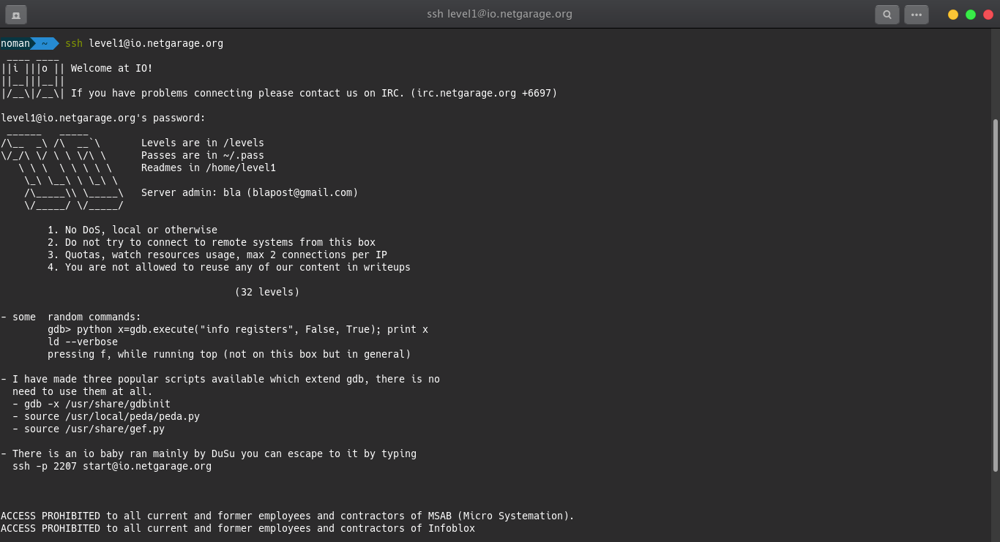
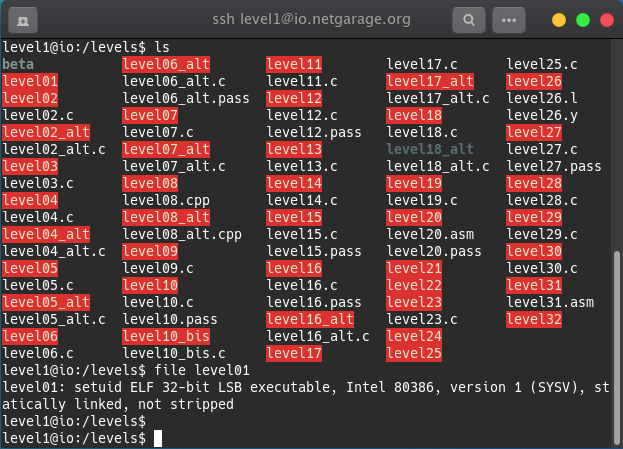
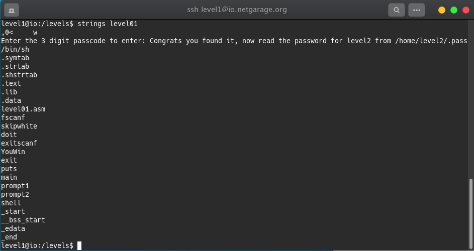
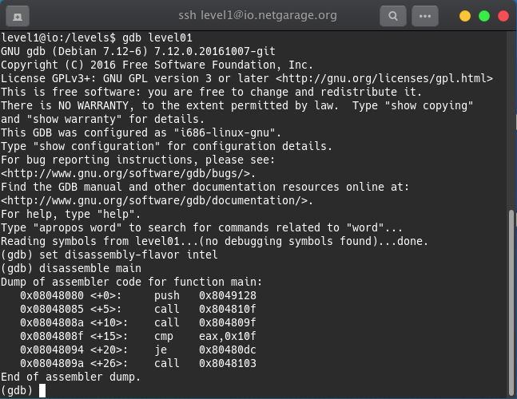
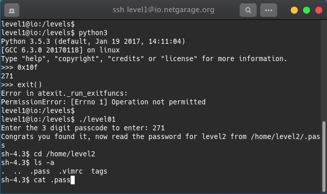

## Level 01 - writeup

First, Access to the server using given SSH credentials. The instructions are shown in the login page.

Go to /levels directory and find level01.
It seems level01 doesn't have source code, hence it should be reverse engineered.

Check the file type as following -

32bit executable file with Intel 80386 architecture.

Now, use strings command to figure out more about this file.

So, there are 3 digit passcode to enter into level02.

Let's do the reverse engineering using **gdb** tool.

There is a line **cmp eax, 0x10f** this is actually comparing the 0x10f value with eax. That means if both matches, the password will be accepted. So, 0x10f is the password but it is in hex format.

Let's convert it into decimal using python and retrive the password.

Now, we get the password and using that we get a new shell. 
After going to **/home/level2** location we can get the password of next level.