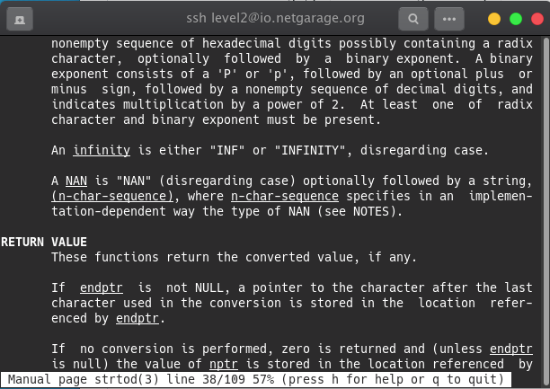

## Level 02 - Writeup

In this level, there are two files having both source code and executable file. One of them is enough to get into next level.


For now, the alternative file will be used.
Let's analyze the **level02_alt** file.


The source code is a bit confusing here. the answer is defined but this is not actually an answer. The condition part is a bit tricky. To get the shell first two condition should fail.

```C
	float a = (argc - 2)?: strtod(argv[1], 0);
```
Let's see the man page of **strtod**(String to Double)



There are two special tokens - INF (Infinity) and NAN (Not A Number). Here, NAN will help us to fail first two condition and catch the else one.


So, we get the shell and after changing the directory to **/home/level3**, we can get the password.