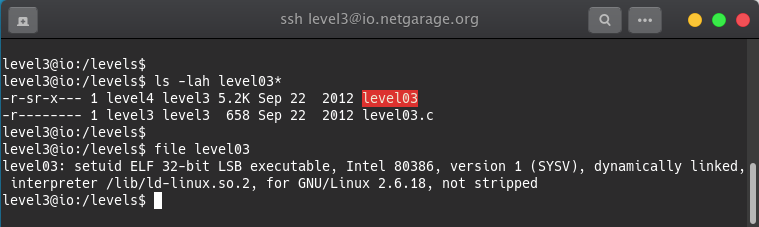
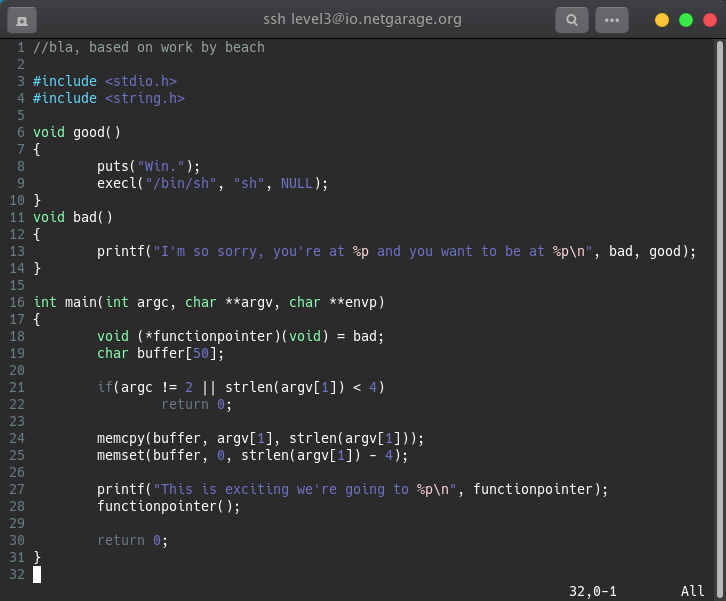
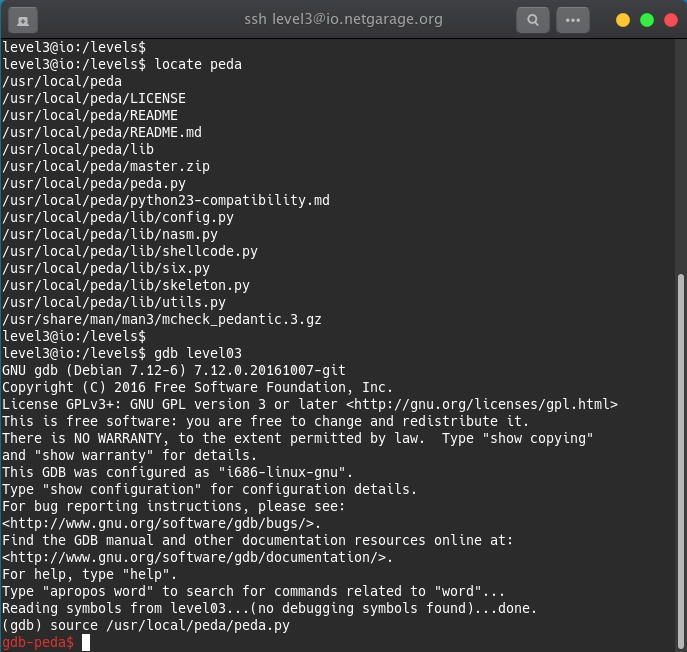
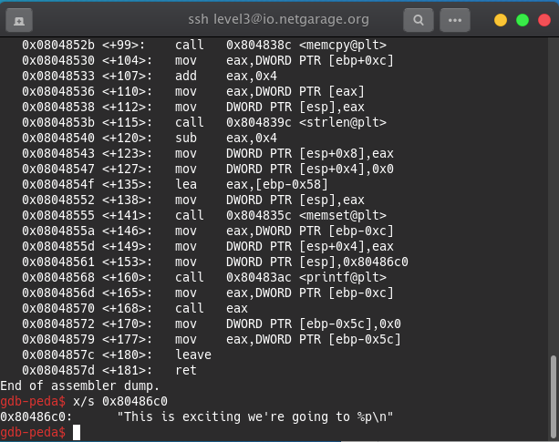
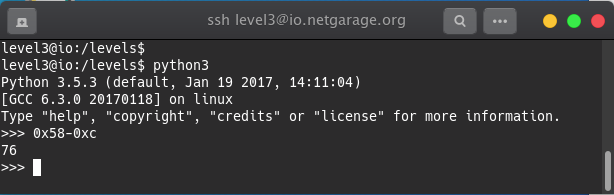
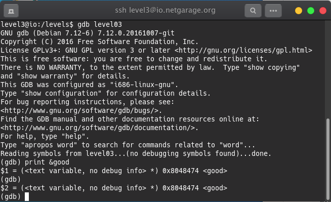
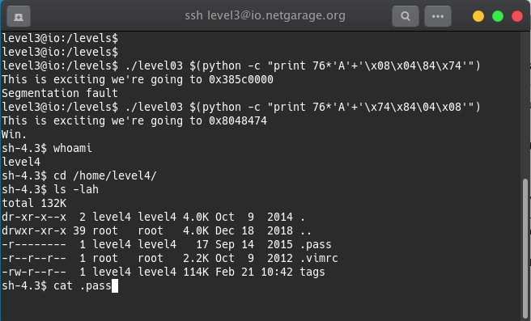

## Level 03 - Writeup

In this level, it has both source file and executable file. Let's check the file architecture.

So, it's a 32bit with Intel 80386 architecture.
Now, Let's see the source code of this level.

From the code, it's understood that the **buffer[50]** has limited size but the **argv[1]** memory has been instructed to be copied. So, the buffer will only hold 50 locations and more than that all other will be overflowed. This known as buffer overflow.

In gdb there is an interesting plugin called gdb-peda which visualize the registers, instructions and stack contents. Let's find it and use it in gdb.

Now, using **dissassemble main** let's find the location of **This is exciting we're going to %p\n"** which is 0x80486c0.

Following the next lines, it is found that the buffer is at **ebp-0x58**

We have to calcualate the distance between buffer and the functionpointer which is used according to the source code.

So, it will be **0x58-0xc** and needs to convert to decimal.

The decimal value is 76.

According to source code, we have to get the good for the proper execution. Now, using gdb try to pint the value of good.

The hex is 0x8048474. Now, with that code let's try to write an exploit with the executable file.

Initially we got an **Segmentation fault** error. We have to be a bit tricky here. The order of the value should be changed. the left should go to right and right should go to left. This is known as Big Endian and this is to overwrite values in memory.

After adding new payload we get the shell. Now, let's change the directory and get the password.